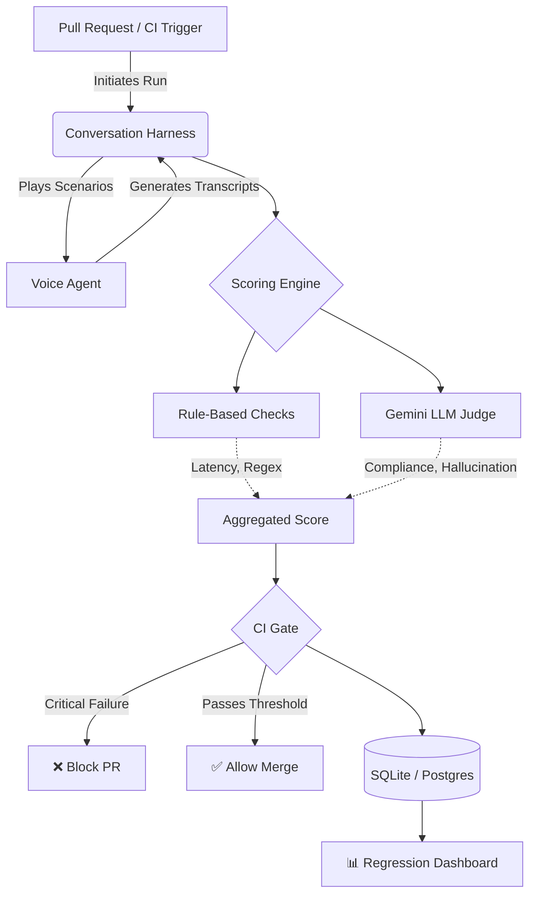

# 🛡️ VoiceGuard CI

An automated CI/CD pipeline for real-time insurance voice agents. Every change is benchmarked, red-teamed, and scored against compliance and hallucination rules before it ships.

## ✨ Technologies

- `Python 3.11+`
- `Gemini`
- `Deepgram`
- `ElevenLabs`
- `Streamlit`
- `GitHub Actions`
- `SQLite / Postgres`

## 🚀 Features

- **Conversation Harness** - Simulates calls and runs complex insurance scenarios against voice agents.
- **Scoring Engine** - Evaluates transcripts for 7 failure classes using a hybrid of rule-based logic and Gemini LLM judges.
- **Regression Dashboard** - Interactive Streamlit UI to track performance deltas across different runs.
- **CI Gate** - Automatically blocks pull requests on compliance violations or hallucinations.
- **Cost-Free Local CI** - Includes a `--mock-llm` flag to run the entire pipeline locally without incurring API costs.

## 📍 The Process

Building voice agents for insurance requires absolute confidence that they won't hallucinate coverage or violate compliance rules. Standard unit tests aren't enough for non-deterministic LLM behavior. VoiceGuard CI was built to solve this by benchmarking every model change, red-teaming failure modes, and converting production mistakes into new evaluation cases—automatically gating regressions before they hit production.

## 🔄 How It Works



## 📦 Quick Start

```bash
# 1. Install dependencies
pip install -r requirements.txt

# 2. Copy env template and fill in your API keys
cp .env.example .env

# 3. Run DB migrations
alembic upgrade head

# 4. Validate scenarios
python -m harness.validate scenarios/

# 5. Dry-run (use --mock-llm to avoid network calls)
python -m harness.run --dry-run --mock-llm

# 6. Run all scenarios (use --mock-llm for local/free testing)
python -m harness.run --all --mock-llm

# 7. Launch dashboard
streamlit run dashboard/app.py
```